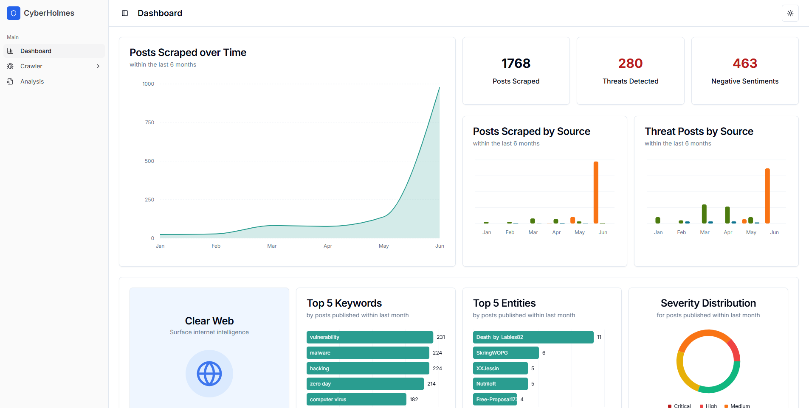
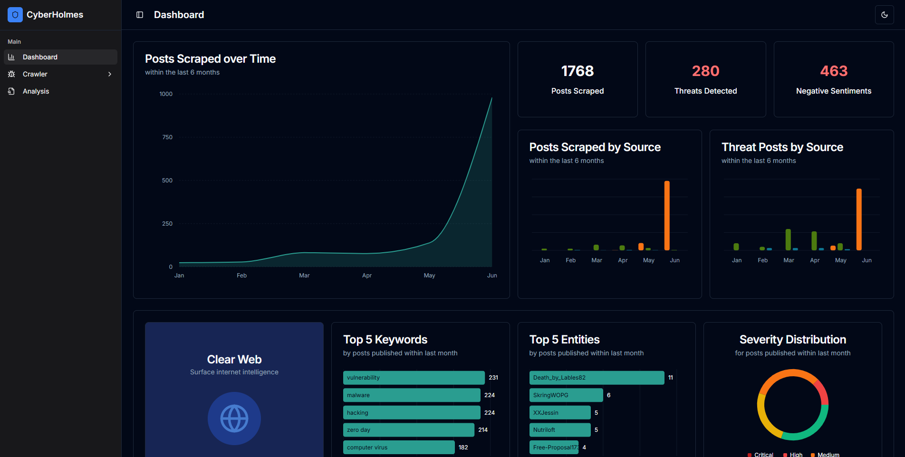
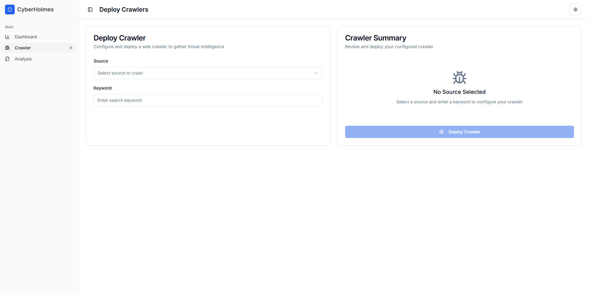
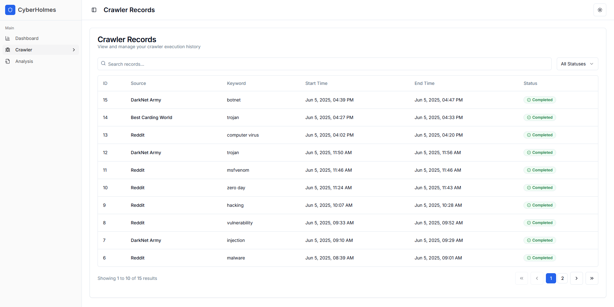
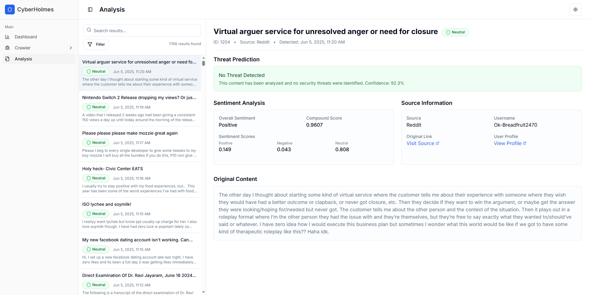
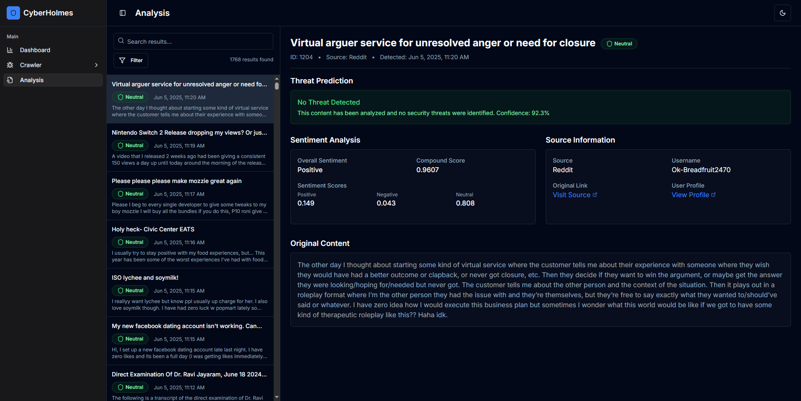
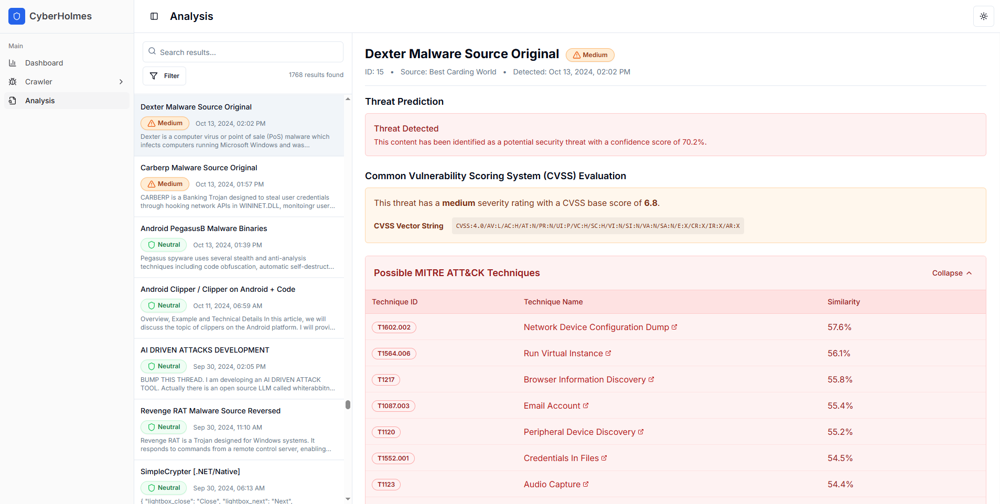
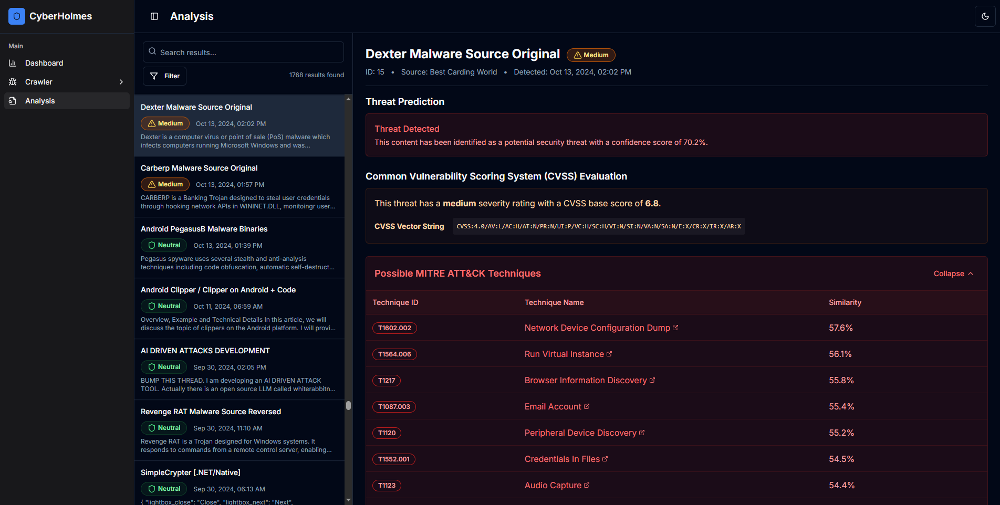

<h1 align="center">🕵🏻‍♂️ CyberHolmes</h1>
<p align="center">
  <strong>Cyber Threat Intelligence Monitoring System</strong><br>
  Final Year Project   •   Bachelor of Computer Science (Hons) (Artificial Intelligence)
</p>

<p align="center">
  
  
  
  
</p>

---


## 💡 Project Overview

**CyberHolmes** is a full-stack, web-based Cyber Threat Intelligence (CTI) monitoring system developed as part of Final Year Project (FYP) for the completion of Bachelor of Computer Science (Honours) (Artificial Intelligence).

The project focuses on detecting and analysing posts that may pose cyber threats by applying advanced natural language processing techniques. It automates the collection of textual data from both clear and dark web forums, followed by prediction and analysis of potential threats using machine learning and deep learning models. The goal is to provide cybersecurity professionals and researchers with actionable intelligence through an interactive dashboard and evaluation, enabling more effective threat monitoring and response.


## 🚀 Features

**1. Data Collection**  
   - Crawls posts and discussions from both clear and dark web forums using `Scrapy` with `Tor` proxy integration to ensure anonymity.

**2. Threat Prediction**  
   - Applies machine learning model (Ensemble = LR + SGD + XGBoost) built using `scikit-learn` to classify text-based data and identify potential cyber threats.

**3. Threat Analysis**  
   - Utilises deep learning model, [SecBERT](https://huggingface.co/jackaduma/SecBERT), imported from `Hugging Face` to perform advanced text analysis on collected data.
   - Enriches threat context using the Common Vulnerability Scoring System (CVSS) via the `cvss` package and MITRE ATT&CK framework data via the `attackcti` package.


## 💻 Tech Stack

| Layer        | Technology     |
|--------------|----------------|
| Frontend     | Next.js        |
| Backend      | Django         |
| Database     | SQLite         |
| Web Server   | NGINX          |


## 📁 Folder Structure

```
/CyberHolmes
│
├── backend/                # Django backend application
│ |── analysis/             # Threat prediction and analysis processes (ML + DL)
│ |── config/               # Django project configuration
│ |── crawler/              # Scrapy-based crawlers for data collection
│ |── main/                 # Core app for main logics and API endpoints
│ |── .gitignore/           # Git ignore rules for backend
│ |── Dockerfile/           # Docker setup for backend service
│ |── manage.py/            # Django project management script
│ |── requirements.txt/     # Python dependencies
│ └── torrc/                # Tor configuration
|
├── frontend/               # Next.js frontend application
│ |── app/                  # App routing and page definitions
│ |── components/           # Reusable React UI components
│ |── config/               # Frontend configuration
│ |── lib/                  # Utility functions and hooks
│ |── styles/               # Global and component-specific CSS styles
│ |── .gitignore/           # Git ignore rules for frontend
│ └── Dockerfile/           # Docker setup for frontend service
|
├── nginx/                  # nginx configuration for reverse proxy
├── docker-compose.yml      # Docker container orchestration
├── LICENSE
└── README.md
```


## ⚙️ Installation & Setup

### ✅ Prerequisites

- Debian-based system
- Git
- Docker  
- Docker Compose  

### 🌀 1. Clone the Repository

```bash
git clone https://github.com/rydzze/CyberHolmes.git
cd CyberHolmes
```

### 🔐 2. Prepare Environment Variables

Create `.env` files for both backend and frontend. Use the provided templates or set your own keys.

`backend/.env`

```ini
DEBUG=True
SECRET_KEY=your-secret-key ¯\_(ツ)_/¯
```

`frontend/.env`

```ini
# If run locally:
NEXT_PUBLIC_API_URL=http://localhost:3001/api

# If run remotely:
NEXT_PUBLIC_API_URL=/api
```

### 🐳 3. Build and Run with Docker

From the root of the project directory:

```bash
docker-compose up --build -d
```

The frontend can be accessed at http://localhost:3000

The backend API can be accessed at http://localhost:3001/api


## 📸 Screenshots of UI

### 📊 Dashboard Views

<p align="center">
  
  <br><em>Figure 1: Dashboard overview (light theme)</em>
</p>

<p align="center">
  
  <br><em>Figure 2: Dashboard overview (dark theme)</em>
</p>

---

### 🕷️ Crawler Interface

<p align="center">
  
  <br><em>Figure 3: Deploying crawlers to collect threat intelligence</em>
</p>

<p align="center">
  
  <br><em>Figure 4: Viewing collected crawler records</em>
</p>

---

### 🧠 Threat Analysis - Non-Threat Examples

<p align="center">
  
  <br><em>Figure 5: Analysis result for a non-threatening post (light theme)</em>
</p>

<p align="center">
  
  <br><em>Figure 6: Analysis result for a non-threatening post (dark theme)</em>
</p>

---

### 🚨 Threat Analysis - Threat Examples

<p align="center">
  
  <br><em>Figure 7: Threat detected with enriched threat context (light theme)</em>
</p>

<p align="center">
  
  <br><em>Figure 8: Threat detected with enriched threat context (dark theme)</em>
</p>